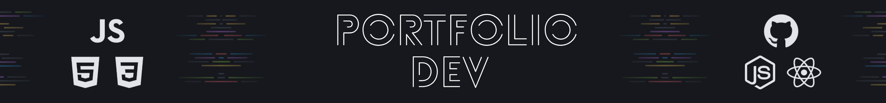

  

---

> ### **Portfólio**

  

    Este é um projeto prático criado para exercitar e fixar os conhecimentos de HTML e CSS adquiridos durante a formação Full-Stack da Rocketseat.
  

  <a href="https://www.figma.com/community/file/1387080701963671866">
    
    
<strong>Layout</strong>

  </a>

**Índice:**

  - [X] Layouts
  - [X] display: Flex
  - [X] display: Grid

  <a href="https://app.rocketseat.com.br/projects/desafio-pratico-portfolio-dev?module_slug=desafio-pratico-portfoliodev&origin=%2Fjourney%2Ffull-stack%2Fcontents">
    
    
<strong>Instruções</strong>

  </a>

  

    <strong>Ferramentas:</strong> VScode, Git, HTML, CSS
  

---

Feito com ❤ by Igor 🖖
